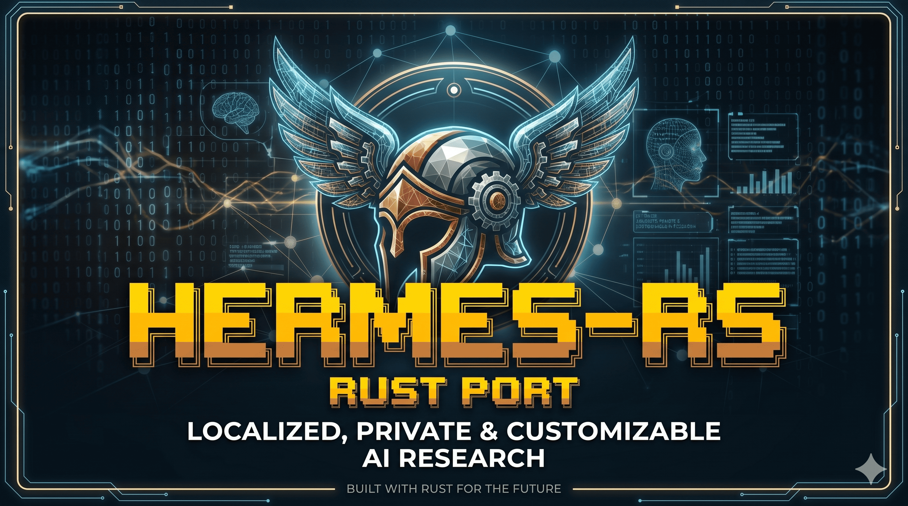

A high-performance Rust implementation of the Hermes-Agent orchestration loop for LLM-driven tool execution.

## Features

- **Streaming-First Architecture**: Detect and execute tool calls incrementally from partial LLM outputs
- **Tolerant XML Parser**: Handle malformed tags and unclosed JSON with state-machine parsing
- **Early Tool Detection**: Initiate tool execution as soon as `</tool_call>` is detected
- **Self-Healing**: Automatically re-prompt LLM with error context on failures
- **Dynamic Schema Generation**: Automatically generate JSON Schema from Rust structs
- **Structured Logging**: Comprehensive observability via the `tracing` crate

## Architecture

```
┌─────────────────────────────────────────────────────────────┐
│                      Hermes-RS                           │
│  ┌─────────────┐  ┌──────────────┐  ┌────────────────────┐  │
│  │ OpenAI      │  │ XMLParser    │  │ ToolRegistry      │  │
│  │ Client      │  │ (Tolerant)   │  │ & Execution       │  │
│  └─────────────┘  └──────────────┘  └────────────────────┘  │
│  ┌─────────────────────────────────────────────────────────┐│
│  │            Orchestration Loop (ReAct)                   ││
│  │  Think → Plan → Execute Tools → Observe → Respond       ││
│  └─────────────────────────────────────────────────────────┘│
└─────────────────────────────────────────────────────────────┘
```

## Installation

```bash
# Build from source
cargo build --release

# Or install via cargo
cargo install --path crates/hermes-cli
```

## Quick Start

```bash
# Set your API key
export OPENAI_API_KEY=your_api_key_here

# Run a simple query
hermes run --query "What is 2 + 2?"

# Interactive chat mode
hermes chat

# List available tools
hermes tools

# Test a specific tool
hermes test echo --args '{"message": "Hello, World!"}'
```

## Configuration

Create a `hermes.toml` or `hermes.yaml` configuration file:

```yaml
# Model configuration
model = "gpt-4"
max_iterations = 20
tool_timeout = 30

# API configuration
api_key = "your_api_key_here"
base_url = "https://api.openai.com/v1"

# System prompt (optional)
system_prompt = "You are a helpful assistant with access to tools."
```

Or use environment variables:

```bash
export OPENAI_API_KEY=your_api_key_here
export OPENAI_BASE_URL=https://api.openai.com/v1
```

## Library Usage

```rust
use hermes_core::{
    agent::{HermesAgent, AgentConfig},
    client::{OpenAIClient, ClientConfig},
    tools::{HermesTool, ToolRegistry, ToolContext},
    schema::ToolSchema,
};
use async_trait::async_trait;
use serde_json::Value;

// Define a custom tool
struct MyTool;

#[async_trait]
impl HermesTool for MyTool {
    fn name(&self) -> &str { "my_tool" }
    fn description(&self) -> &str { "My custom tool" }
    fn schema(&self) -> ToolSchema { /* ... */ }

    async fn execute(&self, args: Value, context: ToolContext) -> ToolResult {
        // Your tool logic here
    }
}

// Create the agent
let client = OpenAIClient::new(ClientConfig::default());
let registry = ToolRegistry::new(std::time::Duration::from_secs(30));
registry.register(MyTool).await.unwrap();

let agent = HermesAgent::new(
    AgentConfig::default(),
    client,
    registry,
);

// Run the agent
let response = agent.run("Hello!").await?;
println!("{}", response.content);
```

## CLI Options

```
hermes [OPTIONS] <COMMAND>

Commands:
  run     Run the agent with a query
  tools   List available tools
  chat    Interactive chat mode
  test    Test a specific tool
  help    Print this message or the help of the given subcommand(s)

Options:
  -v, --verbose           Enable verbose output
  -l, --log-level <LOG>  Log level (debug, info, warn, error) [default: info]
  -c, --config <FILE>    Configuration file path
  --api-key <KEY>        OpenAI API key
  --base-url <URL>       OpenAI base URL
  -m, --model <MODEL>    Model to use [default: gpt-4]
  -i, --max-iterations <N>  Maximum iterations [default: 20]
  -t, --tool-timeout <SECS>  Tool timeout in seconds [default: 30]
```

## Tool Definition

Tools are defined via the `HermesTool` trait. The framework automatically generates JSON Schema from your Rust structs:

```rust
use schemars::JsonSchema;
use serde::Deserialize;

#[derive(JsonSchema, Deserialize)]
#[serde(rename_all = "camelCase")]
struct WeatherArgs {
    city: String,
    country: Option<String>,
}

struct WeatherTool;

#[async_trait]
impl HermesTool for WeatherTool {
    fn name(&self) -> &str { "get_weather" }
    fn description(&self) -> &str { "Get weather information for a city" }
    fn schema(&self) -> ToolSchema {
        ToolSchema::from_type::<WeatherArgs>("get_weather", "Get weather information")
    }

    async fn execute(&self, args: Value, context: ToolContext) -> ToolResult {
        // Parse and execute
    }
}
```

## Error Handling

The library provides structured error types with self-healing capabilities:

```rust
use hermes_core::error::Error;

match result {
    Ok(response) => { /* handle success */ }
    Err(Error::ToolNotFound { name }) => {
        // Tool doesn't exist - self-healing will re-prompt LLM
    }
    Err(Error::ToolTimeout { name, timeout }) => {
        // Tool timed out - retry logic available
    }
    Err(e) => {
        // Other errors
    }
}
```

## License

Dual-licensed under [MIT](LICENSE-MIT) or [Apache 2.0](LICENSE-APACHE).

## Contributing

See [CONTRIBUTING.md](CONTRIBUTING.md) for coding conventions, testing requirements, and the PR process.

- [Security Policy](SECURITY.md)
- [Code of Conduct](CODE_OF_CONDUCT.md)
- [Changelog](CHANGELOG.md)

## Credits & Attribution

This project is a Rust implementation of the [Hermes-Agent](https://github.com/nousresearch/hermes-agent) originally developed by [Nous Research](https://nousresearch.com). 

While this is a "pure Rust" rewrite, the orchestration logic, system prompts, and architecture are based on the original work. This project is an unofficial community port and is not affiliated with or endorsed by Nous Research.