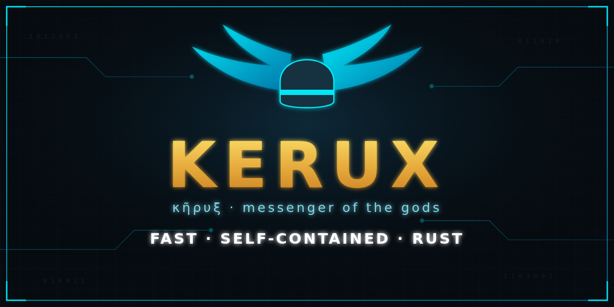
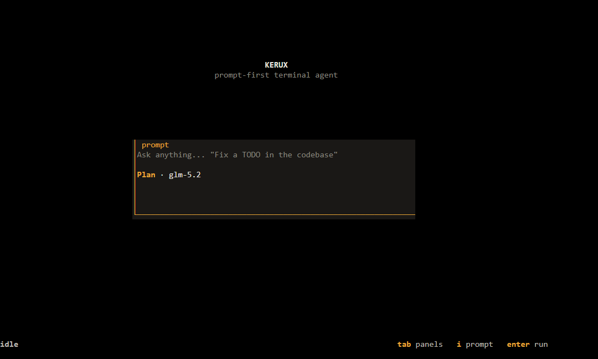
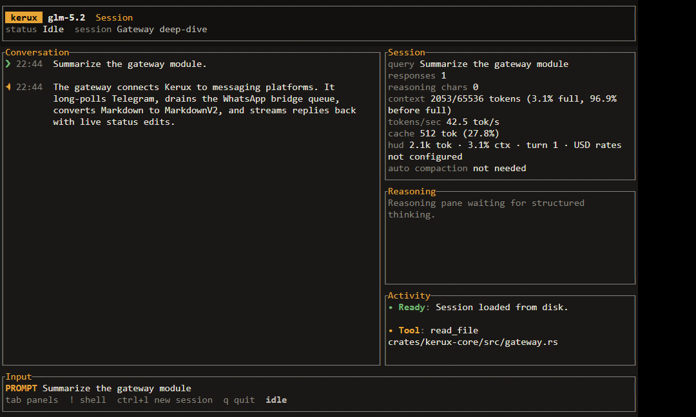

A high-performance Rust implementation of the Kerux-Agent orchestration loop for LLM-driven tool execution.

📖 **Documentation:** [kerux.eikarna.dev](https://kerux.eikarna.dev/)

## Features

- **Streaming-First Architecture**: Detect and execute tool calls incrementally from partial LLM outputs
- **Tolerant XML Parser**: Handle malformed tags and unclosed JSON with state-machine parsing
- **Early Tool Detection**: Initiate tool execution as soon as `</tool_call>` is detected
- **Self-Healing**: Automatically re-prompt LLM with error context on failures
- **Dynamic Schema Generation**: Automatically generate JSON Schema from Rust structs
- **Shared TOML Configuration**: One runtime config model across `kerux-cli` and `kerux-core`
- **Ratatui TUI**: Prompt-first landing view, responsive workspace panes, constrained-terminal fallback, blockquote-style reasoning, block-style tool activity, MCP/Skills/Behavior management
- **Autonomous Coding Mode**: 24/7 workspace-driven loop that reads `TODO.md`, validates with local tests, and only pushes after success
- **Structured Logging**: Comprehensive observability via the `tracing` crate
- **Repo Map Context**: Tree-sitter symbol extraction + personalized PageRank render a token-budgeted `<repo_map>` into the system prompt (`[agent] repo_map_tokens`)
- **Token-Efficient Edits**: `edit_block` tool applies ordered search/replace pairs atomically; model capability routing hints the right edit format per provider/model
- **Transactional Git Harness**: Pre-run snapshots with dirty-tree protection, Conventional Commit derivation, and a TUI `/undo` command to roll back a run's file changes
- **Lifecycle Curator**: Background pass keeping memory and skills healthy — importance decay, near-duplicate pruning, session archiving, stale skill auto-archiving, and distillation of recurring facts into draft skills

### Gateway Features (F1–F6)

- **F1 Tool Approval**: Telegram inline-keyboard `[✅][❌]` approval gate before tool execution
- **F2 Context Compaction**: rolling LLM summarization of old turns, session format v2 with persistent summary
- **F3 Fallback Provider Chain**: automatic failover on transient errors (network/429/5xx), default OFF
- **F4 Voice Note STT**: Telegram voice notes transcribed via `/v1/audio/transcriptions`
- **F5 Cron Scheduler**: `/cron add|list|pause|resume|remove` with atomic JSON persistence
- **F6 Subagent Delegation**: `delegate_to_sub_agent` tool — isolated child agents, max 3 concurrent, depth 1

## Architecture

```
┌─────────────────────────────────────────────────────────────┐
│                      Kerux                           │
│  ┌─────────────┐  ┌──────────────┐  ┌────────────────────┐  │
│  │ OpenAI      │  │ XMLParser    │  │ ToolRegistry      │  │
│  │ Client      │  │ (Tolerant)   │  │ & Execution       │  │
│  └─────────────┘  └──────────────┘  └────────────────────┘  │
│  ┌─────────────────────────────────────────────────────────┐│
│  │            Orchestration Loop (ReAct)                   ││
│  │  Think → Plan → Execute Tools → Observe → Respond       ││
│  └─────────────────────────────────────────────────────────┘│
└─────────────────────────────────────────────────────────────┘
```

## Installation

```bash
# Build from source
cargo build --release

# Or install the CLI crate directly
cargo install --path crates/kerux-cli
```

Tagged releases publish per-platform binaries automatically in the repository's GitHub Releases tab.

## Quick Start

```bash
# Set your API key
export OPENAI_API_KEY=your_api_key_here   # PowerShell: $env:OPENAI_API_KEY="..."

# Start the prompt-first TUI
kerux chat

# Run a one-shot query
kerux run --query "What is 2 + 2?"

# Start 24/7 autonomous workspace mode
kerux autonomous

# List available tools
kerux tools

# Test a specific tool
kerux test echo --args '{"message": "Hello, World!"}'

# Create a local auth profile that references an environment variable
kerux auth set-api-key openai --env OPENAI_API_KEY

# Show provider names, documented auth methods, and Kerux-supported env sources
kerux auth providers

# Reference an existing OAuth/ADC bearer token without storing it in config
kerux auth set-bearer-token Google --env GOOGLE_OAUTH_ACCESS_TOKEN --base-url https://generativelanguage.googleapis.com/v1beta
```

## Screenshots

Prompt-first landing screen:



Workspace session with conversation, reasoning, and activity panes:



## Configuration

Kerux reads configuration in this order:

1. `--config <path>`
2. `./kerux.toml`
3. `./.kerux.toml`
4. OS config directory (for example `~/.config/kerux/config.toml` on Linux)
5. Environment variables
6. CLI flags

Start from the checked-in example file:

```bash
cp kerux.example.toml kerux.toml
```

Configuration is TOML, not YAML. Example:

```toml
[client]
provider = "openai" # openai | anthropic | ollama | openrouter
base_url = "https://api.openai.com/v1"
timeout_secs = 60
# api_key = "set me or use OPENAI_API_KEY"
# auth_ref = "openai-default"

# Provider endpoint overrides and env credentials:
# [client.anthropic]  # uses ANTHROPIC_API_KEY when api_key is omitted
# [client.openrouter] # uses OPENROUTER_API_KEY when api_key is omitted
# [client.ollama]     # defaults to http://localhost:11434/v1
# [client.gemini]     # uses GEMINI_API_KEY; base defaults to generativelanguage.googleapis.com/v1beta

[agent]
model = "gpt-4"
max_iterations = 20
tool_timeout_secs = 30
request_timeout_secs = 120
stream = true
show_reasoning = true

[autonomous]
interval_secs = 300
todo_path = "TODO.md"
status_path = "autonomous-status.toml"
test_command = "cargo test --workspace"
git_remote = "origin"
git_branch = "agent-dev"
commit_message = "Auto-commit by kerux"

[tui]
rich_output = true
landing_title = "KERUX"
prompt_placeholder = "Ask anything... \"Fix a TODO in the codebase\""

[telemetry]
enabled = true
currency = "USD"
# Optional provider/model rates for spend estimates.
input_cost_per_million = 0.0
output_cost_per_million = 0.0
```

Or use environment variables:

```bash
export KERUX_PROVIDER=openai # anthropic | ollama | openrouter | gemini
export OPENAI_API_KEY=your_api_key_here
export OPENAI_BASE_URL=https://api.openai.com/v1
export KERUX_MODEL=gpt-4
```

See [kerux.example.toml](kerux.example.toml) for the full schema, including MCP, Skills, gateway, and tool/runtime defaults.

## Authentication profiles

Kerux supports local auth metadata profiles without storing API keys in the project config. Create one with:

```bash
kerux auth providers
kerux auth login OpenAI # prints current external setup guidance; does not store tokens yet
kerux auth set-api-key OpenAI --env OPENAI_API_KEY
kerux auth set-bearer-token Google --env GOOGLE_OAUTH_ACCESS_TOKEN --base-url https://generativelanguage.googleapis.com/v1beta
kerux auth list
```

Then point `[client].auth_ref` at the profile name, for example `openai-default`. The profile stores only metadata and an environment-variable reference such as `env:OPENAI_API_KEY`; the actual secret remains in your environment or external secret manager.

`set-bearer-token` is intended for provider-documented OAuth/ADC access tokens that are already obtained outside Kerux and requires `--base-url` so the token is bound to the intended provider endpoint. Kerux does not refresh those tokens yet; rotate or refresh the referenced environment value with the provider's official tooling.

Current provider names are `Google`, `GitHub Copilot`, `OpenAI`, and `Anthropic`. `kerux auth providers` prints aliases, API-key environment variables, bearer-token defaults, documented auth methods, Kerux-supported environment sources, and implementation notes. `kerux auth login <provider>` prints provider-specific setup guidance and exits without creating credentials until Kerux has secure token storage and provider-specific login flows.

### Nous Portal (OAuth device-code login)

Kerux supports the Nous Portal device-code OAuth flow natively — no API key required:

```bash
kerux auth login nous
# opens https://portal.nousresearch.com in your browser; approve the device code
```

This stores an OAuth profile (`nous-default`) in the auth store. The access token is a short-lived invoke JWT; Kerux refreshes it automatically from the persisted refresh token before each inference request. Then point the client at it:

```toml
[client]
provider = "nous"
auth_ref = "nous-default"
```

Or with CLI flags:

```bash
kerux chat --auth-ref nous-default   # provider defaults to "nous" when auth_ref is an OAuth profile
```

To remove the stored credentials:

```bash
kerux auth logout nous
```

Provider reality check:

- **OpenAI**: Kerux supports API-key profiles today. OpenAI also documents ChatGPT/Codex browser login, device/headless login, and access-token/cache workflows for Codex, but Kerux has not wired those OAuth credentials into runtime requests yet.
- **Google**: Gemini supports API keys and OAuth/ADC. Direct desktop OAuth requires a Google OAuth client ID; using `gcloud auth application-default login` keeps token management outside Kerux.
- **GitHub Copilot**: Copilot CLI supports OAuth device flow, supported GitHub tokens via `COPILOT_GITHUB_TOKEN` / `GH_TOKEN` / `GITHUB_TOKEN`, OS keychain storage, and GitHub CLI fallback. Kerux can reference external tokens today; it does not run Copilot login itself yet.
- **Anthropic**: Kerux supports the native Messages API with `x-api-key` headers, tool calls, and SSE streaming through `[client].provider = "anthropic"` and `ANTHROPIC_API_KEY`. Claude-account OAuth and cloud-provider routes such as Vertex/Bedrock are not wired yet.

Kerux routes runtime requests by `[client].provider`. OpenAI, Ollama, and OpenRouter use OpenAI-compatible chat-completions endpoints; Anthropic uses the native Messages API. API keys continue to flow through `auth_ref` profiles when configured. When `auth_ref` is active, credentials are bound to the endpoint stored in the auth profile to prevent repo-local config from redirecting secrets.

When `auth_ref` is active, Kerux binds the credential to the profile endpoint, including provider-specific endpoints. Use `kerux auth set-api-key <provider> --base-url <url>` for non-default endpoints instead of setting a repo-local `[client].base_url` that could redirect credentials.

OAuth browser/device login is intentionally not enabled until provider-specific secure token storage and documented OAuth flows are implemented. See [OAUTH_DESIGN.md](OAUTH_DESIGN.md) for the phased plan.

## Workspace Context

- Kerux automatically loads the nearest workspace guidance file from `AGENTS.md`, `CLAUDE.md`, `.kerux.md`, `KERUX.md`, or `.cursorrules` and injects it into the system prompt as `<workspace_context>`
- Global `.md` / `.txt` context files under the user Kerux context directory are also included when present
- Oversized context files are truncated and obvious prompt-injection patterns are blocked before injection

## Autonomous Mode

- `kerux autonomous` runs a continuous loop against the current workspace
- `kerux run --autonomous` is kept as a compatibility alias for the same mode
- Autonomous mode reads repo-root `TODO.md` on every tick and skips work when `## Pending` is empty
- The loop uses the existing Kerux agent and tools to inspect the repo, implement the next pending task, and update `TODO.md`
- Kerux writes a repo-local `autonomous-status.toml` report on each tick with the current state, failure summary, validation result, and last push target
- After each iteration Kerux runs the configured validation command, which defaults to `cargo test --workspace`
- Git operations are strict:
  - tests must pass before any push is attempted
  - successful runs stage workspace changes while excluding the status report, then execute `git commit -m "Auto-commit by kerux"` and `git push origin agent-dev`
  - repeated failures on the same workspace state pause the loop until `TODO.md` or git state changes, and that pause survives process restarts through `autonomous-status.toml`

`TODO.md` is the autonomous source of truth and should keep this structure:

```md
## Implemented
- completed work

## Pending
- next tasks for autonomous mode
```

## TUI Overview

- `kerux chat` starts on a prompt-first landing screen
- `i` enters prompt editing, and typing on landing also bootstraps prompt entry immediately
- `Enter` runs the current prompt
- Prefix a prompt with `!` or `$ ` to prepare a shell command in the workspace, then press `Enter` again to confirm and run it
- `Up` / `Down` in prompt mode replay recent prompts from history
- `Tab` cycles workspace panels
- `Up` / `Down` scroll the chat in command mode
- `PageUp`, `PageDown`, `Home`, and `End` scroll the conversation even while prompt mode is active
- `Ctrl+L` starts a fresh session when you want to discard the current conversation history
- The workspace uses a split desktop layout at 120 columns and above, stacks panels below that, and collapses secondary panels into popups below 65 columns or 20 rows
- The Reasoning pane renders model thinking with quote rails, while tool calls in Activity render as compact blocks for easier scanning
- The header shows a step progress indicator while a run is active, and the Session panel updates token/context usage during streaming, remaining context percentage, latest auto-compaction status, and estimated spend when `[telemetry]` rates are configured
- Streaming responses normalize both OpenAI-compatible chat-completion chunks and Claude/Anthropic-style SSE text, thinking, and tool-use deltas into the same TUI event flow
- After a run completes or fails, the workspace returns to prompt mode so you can send a follow-up in the same session
- `stream = false` now uses the non-streaming response path instead of the streaming parser

### Disposable Repo Workflow

Use a throwaway repository first to validate your autonomous setup end to end:

```bash
mkdir kerux-autonomous-sample
cd kerux-autonomous-sample
git init
git checkout -b agent-dev
cp ../kerux/kerux.example.toml ./kerux.toml
```

Create a minimal `TODO.md`:

```md
## Implemented
- bootstrap sample repo

## Pending
- add one safe autonomous task
```

Then tune `[autonomous]` in `kerux.toml` for the sample repo:

```toml
[autonomous]
todo_path = "TODO.md"
status_path = "autonomous-status.toml"
test_command = "git diff --check"
git_remote = "origin"
git_branch = "agent-dev"
```

Run Kerux:

```bash
kerux autonomous
```

While it runs, inspect:

- `TODO.md` to confirm completed items move from `Pending` to `Implemented`
- `autonomous-status.toml` to see `state`, timing fields, failure or pause metadata, the last validation summary, and the last push target
- `git log --oneline` to confirm only validated work is committed

If the loop pauses after repeated failures, edit `TODO.md` or otherwise change the workspace state, then start or continue `kerux autonomous` again. Kerux reloads the persisted pause state from `autonomous-status.toml` and resumes only after the workspace fingerprint changes.

## Library Usage

```rust
use kerux_core::{
    agent::{KeruxAgent, AgentConfig},
    client::{OpenAIClient, ClientConfig},
    tools::{KeruxTool, ToolRegistry, ToolContext},
    schema::ToolSchema,
};
use async_trait::async_trait;
use serde_json::Value;

// Define a custom tool
struct MyTool;

#[async_trait]
impl KeruxTool for MyTool {
    fn name(&self) -> &str { "my_tool" }
    fn description(&self) -> &str { "My custom tool" }
    fn schema(&self) -> ToolSchema { /* ... */ }

    async fn execute(&self, args: Value, context: ToolContext) -> ToolResult {
        // Your tool logic here
    }
}

// Create the agent
let client = OpenAIClient::new(ClientConfig::default());
let registry = ToolRegistry::new(std::time::Duration::from_secs(30));
registry.register(MyTool).await.unwrap();

let agent = KeruxAgent::new(
    AgentConfig::default(),
    client,
    registry,
);

// Run the agent
let response = agent.run("Hello!").await?;
println!("{}", response.content);
```

## CLI Options

```
kerux [OPTIONS] <COMMAND>

Commands:
  autonomous  Run the autonomous coding loop
  run     Run the agent with a query
  tools   List available tools
  chat    Interactive chat mode
  test    Test a specific tool
  help    Print this message or the help of the given subcommand(s)

Options:
  -v, --verbose           Enable verbose output
  -l, --log-level <LOG>  Log level (debug, info, warn, error) [default: info]
  -c, --config <FILE>    Configuration file path
  --api-key <KEY>        OpenAI API key
  --base-url <URL>       OpenAI base URL
  -m, --model <MODEL>    Model to use [default: gpt-4]
  -i, --max-iterations <N>  Maximum iterations [default: 20]
  --tool-timeout <SECS>  Tool timeout in seconds [default: 30]
  --request-timeout <SECS>  Request timeout in seconds
  --context-window <TOKENS> Context window size
  --max-healing-attempts <N> Maximum self-healing retries
  --stream / --no-stream  Force streaming on or off
```

## Tool Definition

Tools are defined via the `KeruxTool` trait. The framework automatically generates JSON Schema from your Rust structs:

```rust
use schemars::JsonSchema;
use serde::Deserialize;

#[derive(JsonSchema, Deserialize)]
#[serde(rename_all = "camelCase")]
struct WeatherArgs {
    city: String,
    country: Option<String>,
}

struct WeatherTool;

#[async_trait]
impl KeruxTool for WeatherTool {
    fn name(&self) -> &str { "get_weather" }
    fn description(&self) -> &str { "Get weather information for a city" }
    fn schema(&self) -> ToolSchema {
        ToolSchema::from_type::<WeatherArgs>("get_weather", "Get weather information")
    }

    async fn execute(&self, args: Value, context: ToolContext) -> ToolResult {
        // Parse and execute
    }
}
```

Kerux can also register `delegate_to_sub_agent`, an opt-in built-in tool that lets the parent ReAct agent delegate focused deep-analysis tasks to an isolated child `KeruxAgent` with a fresh conversation.

## Error Handling

The library provides structured error types with self-healing capabilities:

```rust
use kerux_core::error::Error;

match result {
    Ok(response) => { /* handle success */ }
    Err(Error::ToolNotFound { name }) => {
        // Tool doesn't exist - self-healing will re-prompt LLM
    }
    Err(Error::ToolTimeout { name, timeout }) => {
        // Tool timed out - retry logic available
    }
    Err(e) => {
        // Other errors
    }
}
```

## License

Dual-licensed under [MIT](LICENSE-MIT) or [Apache 2.0](LICENSE-APACHE).

## Contributing

See [CONTRIBUTING.md](CONTRIBUTING.md) for coding conventions, testing requirements, and the PR process.

Documentation and release hygiene for maintainers:

- keep `kerux.example.toml` in sync with runtime config changes
- add every user-facing change to `CHANGELOG.md` before cutting a tag
- update README screenshots or keybinding docs when TUI behavior changes
- update `AGENTS.md` / `CLAUDE.md` when the project context changes enough that an agent would otherwise rediscover it from scratch

- [Security Policy](SECURITY.md)
- [Code of Conduct](CODE_OF_CONDUCT.md)
- [Changelog](CHANGELOG.md)

## Credits & Attribution

This project is a Rust implementation of the [Hermes-Agent](https://github.com/nousresearch/hermes-agent) originally developed by [Nous Research](https://nousresearch.com). 

While this is a "pure Rust" rewrite, the orchestration logic, system prompts, and architecture are based on the original work. This project is an unofficial community port and is not affiliated with or endorsed by Nous Research.
